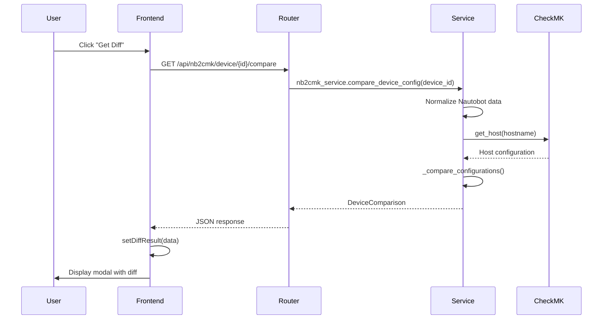
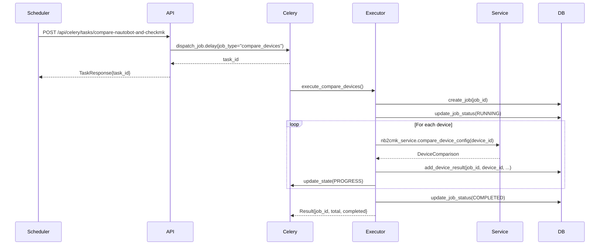

# CheckMK Live Update Architecture

## Overview

The CheckMK Live Update feature provides two distinct ways to compare Nautobot device configurations with CheckMK host configurations:

1. **Live/Direct Comparison** - Direct API calls from the frontend for immediate, single-device comparisons
2. **Batch/Background Comparison** - Celery background tasks for scheduled or bulk comparisons across multiple devices

Both approaches share the same core comparison logic but differ in how they're triggered, tracked, and how results are stored/displayed.

---

## Architecture Diagram

```
┌─────────────────────────────────────────────────────────────────────────┐
│                          FRONTEND (Next.js/React)                       │
│                            live-update-page.tsx                         │
└─────────────────────┬──────────────────────────┬────────────────────────┘
                      │                          │
        ┌─────────────▼──────────┐    ┌──────────▼─────────────┐
        │  Live Comparison       │    │  Batch Comparison      │
        │  (Direct API Call)     │    │  (Celery Task)         │
        └─────────────┬──────────┘    └──────────┬─────────────┘
                      │                          │
                      │                          │
┌─────────────────────▼──────────────────────────▼───────────────────────┐
│                          BACKEND (FastAPI)                             │
│                                                                        │
│  ┌──────────────────────────────┐   ┌───────────────────────────────┐  │
│  │  Direct Endpoint             │   │  Celery Task Endpoint         │  │
│  │  /api/nb2cmk/device/{id}/    │   │  /api/celery/tasks/           │  │
│  │         compare              │   │  compare-nautobot-and-checkmk │  │
│  │                              │   │                               │  │
│  │  routers/checkmk/sync.py     │   │  routers/jobs/celery_api.py   │  │
│  └──────────────┬───────────────┘   └──────────────┬────────────────┘  │
│                 │                                  │                   │
│                 │                                  ▼                   │
│                 │                    ┌──────────────────────────────┐  │
│                 │                    │  tasks/scheduling/           │  │
│                 │                    │  job_dispatcher.py           │  │
│                 │                    │  (dispatch_job task)         │  │
│                 │                    └──────────────┬───────────────┘  │
│                 │                                   │                  │
│                 │                    ┌──────────────▼───────────────┐  │
│                 │                    │  tasks/execution/            │  │
│                 │                    │  compare_executor.py         │  │
│                 │                    │  (execute_compare_devices)   │  │
│                 │                    └──────────────┬───────────────┘  │
│                 │                                   │                  │
│                 └───────────────┬───────────────────┘                  │
│                                 │                                      │
│                 ┌───────────────▼────────────────────┐                 │
│                 │  SHARED CORE COMPARISON LOGIC      │                 │
│                 │                                    │                 │
│                 │  services/checkmk/sync/base.py     │                 │
│                 │  NautobotToCheckMKService          │                 │
│                 │  - compare_device_config()         │                 │
│                 │  - _compare_configurations()       │                 │
│                 │                                    │                 │
│                 └───────────────┬────────────────────┘                 │
│                                 │                                      │
│                 ┌───────────────▼────────────────────┐                 │
│                 │  SHARED DEPENDENCIES               │                 │
│                 │                                    │                 │
│                 │  - services/checkmk/normalization  │                 │
│                 │  - services/checkmk/client         │                 │
│                 │  - services/checkmk/config         │                 │
│                 │  - routers/checkmk (get_host)      │                 │
│                 └────────────────────────────────────┘                 │
└────────────────────────────────────────────────────────────────────────┘
                                 │
                ┌────────────────┴───────────────┐
                │                                │
        ┌───────▼─────────┐            ┌─────────▼──────────┐
        │  Direct Result  │            │  Background Storage│
        │  (Immediate)    │            │  (Database)        │
        │                 │            │                    │
        │  Returns to     │            │  NB2CMK Tables:    │
        │  frontend       │            │  - nb2cmk_jobs     │
        │  immediately    │            │  - nb2cmk_results  │
        └─────────────────┘            │                    │
                                       │  For later viewing │
                                       │  in Sync Devices   │
                                       │  and Jobs/Views    │
                                       └────────────────────┘
```

---

## 1. Shared Core Logic

### Location
- **File**: `backend/services/checkmk/sync/base.py`
- **Class**: `NautobotToCheckMKService`
- **Main Method**: `compare_device_config(device_id: str) -> DeviceComparison`

### Functionality
This is the **single source of truth** for device comparison logic. It:

1. **Normalizes Nautobot device data** using `device_normalization_service`
2. **Fetches CheckMK host configuration** via internal API (`routers/checkmk.get_host`)
3. **Compares configurations** using `_compare_configurations()` method
4. **Returns structured comparison result** as `DeviceComparison` model

### Key Methods

```python
async def compare_device_config(self, device_id: str) -> DeviceComparison:
    """
    Compare normalized Nautobot device config with CheckMK host config.
    
    Returns:
        DeviceComparison with:
        - result: 'equal' | 'diff' | 'host_not_found'
        - diff: text description of differences
        - normalized_config: expected config from Nautobot
        - checkmk_config: actual config from CheckMK
        - ignored_attributes: list of attributes ignored in comparison
    """
```

```python
def _compare_configurations(
    self, nb_config: Dict[str, Any], cmk_config: Dict[str, Any]
) -> List[str]:
    """
    Compare configurations attribute by attribute.
    Uses comparison keys and ignore lists from config_service.
    """
```

### Shared Dependencies

Both approaches use:
- **Normalization**: `services/checkmk/normalization.py` - Transforms Nautobot data to CheckMK format
- **CheckMK Client**: `services/checkmk/client.py` - API communication with CheckMK
- **Configuration Service**: `services/checkmk/config.py` - Loads ignore lists, comparison keys, SNMP mappings
- **Host API**: `routers/checkmk.get_host()` - Fetches host configuration from CheckMK

---

## 2. Live/Direct Comparison (Frontend-Initiated)

### Use Case
- User clicks "Get Diff" button on a single device
- Immediate visual feedback needed
- Results displayed in modal dialog
- No persistent storage required

### Flow

```
User clicks "Get Diff"
    ↓
Frontend: handleGetDiff(device)
    ↓
API Call: GET /api/nb2cmk/device/{device_id}/compare
    ↓
Backend Router: routers/checkmk/sync.py
    @router.get("/device/{device_id}/compare")
    async def compare_device_config(device_id: str)
    ↓
Service Call: nb2cmk_service.compare_device_config(device_id)
    ↓
[SHARED CORE LOGIC - services/checkmk/sync/base.py]
    ↓
Result: DeviceComparison object returned
    ↓
Frontend: setDiffResult(data)
    ↓
UI: Modal displays comparison in side-by-side table
```

### Frontend Implementation

**File**: `frontend/src/components/features/checkmk/live-update/live-update-page.tsx`

```typescript
const handleGetDiff = useCallback(async (device: Device) => {
  try {
    setLoadingDiff(true)
    setSelectedDevice(device)
    setIsDiffModalOpen(true)

    // Direct API call - no Celery task
    const response = await apiCall<DiffResult['differences']>(
      `nb2cmk/device/${device.id}/compare`
    )

    if (response) {
      const diffData = {
        device_id: device.id,
        device_name: device.name,
        differences: response,
        timestamp: new Date().toISOString()
      }
      setDiffResult(diffData)
      
      // Store result for table row coloring
      setDeviceDiffResults(prev => ({
        ...prev,
        [device.id]: response.result
      }))
    }
  } catch (err) {
    showMessage(`Failed to get diff: ${err.message}`, 'error')
  } finally {
    setLoadingDiff(false)
  }
}, [apiCall, showMessage])
```

### Backend Endpoint

**File**: `backend/routers/checkmk/sync.py`

```python
@router.get("/device/{device_id}/compare")
async def compare_device_config(
    device_id: str,
    current_user: dict = Depends(require_permission("checkmk.devices", "read")),
):
    """Compare normalized Nautobot device config with CheckMK host config."""
    try:
        logger.info(f"[ROUTER] Compare request for device ID: {device_id}")
        result = await nb2cmk_service.compare_device_config(device_id)
        logger.info(f"[ROUTER] Compare successful for device ID: {device_id}")
        return result.model_dump()
    except HTTPException as http_exc:
        raise
    except Exception as e:
        raise HTTPException(
            status_code=status.HTTP_500_INTERNAL_SERVER_ERROR,
            detail=f"Unexpected error: {str(e)}",
        )
```

### Characteristics
- **Synchronous**: Blocks until comparison completes
- **No persistence**: Results stored only in frontend state
- **Immediate feedback**: User sees results in modal within seconds
- **Single device**: Optimized for one device at a time
- **No job tracking**: No entry in jobs database

---

## 3. Batch/Background Comparison (Celery Task)

### Use Case
- Scheduled periodic comparisons (e.g., nightly)
- Manual bulk comparisons of multiple devices
- Results need to be stored for later review
- Progress tracking across many devices
- Viewable in "Sync Devices" or "Jobs/Views" apps

### Flow

```
Trigger: Schedule or Manual API Call
    ↓
API Call: POST /api/celery/tasks/compare-nautobot-and-checkmk
           { device_ids: [...] }  // optional, null = all devices
    ↓
Backend Router: routers/jobs/celery_api.py
    @router.post("/tasks/compare-nautobot-and-checkmk")
    async def trigger_compare_nautobot_and_checkmk(device_ids)
    ↓
Celery Task Queue: dispatch_job.delay(
    job_name="Device Comparison (Manual)",
    job_type="compare_devices",
    target_devices=device_ids,
    triggered_by="manual"
)
    ↓
Task Dispatcher: tasks/scheduling/job_dispatcher.py
    @shared_task(name="tasks.dispatch_job")
    def dispatch_job(job_type="compare_devices", ...)
    ↓
Job Executor: tasks/execution/compare_executor.py
    def execute_compare_devices(target_devices, task_context)
    ↓
Database: Create job record in nb2cmk_jobs table
          job_id = f"scheduled_compare_{task_id}"
    ↓
Loop through devices:
    For each device_id:
        ↓
    [SHARED CORE LOGIC - nb2cmk_service.compare_device_config(device_id)]
        ↓
    Store Result: nb2cmk_db_service.add_device_result(
        job_id, device_id, device_name,
        checkmk_status, diff, normalized_config, 
        checkmk_config, ignored_attributes
    )
        ↓
    Update Progress: task_context.update_state(progress)
    ↓
Mark job completed: nb2cmk_db_service.update_job_status(COMPLETED)
    ↓
Return: { 
    success: true, 
    job_id: "scheduled_compare_xyz",
    total: 100, 
    completed: 98, 
    failed: 2,
    differences_found: 15
}
```

### Backend Implementation

#### 1. Trigger Endpoint

**File**: `backend/routers/jobs/celery_api.py`

```python
@router.post("/tasks/compare-nautobot-and-checkmk", response_model=TaskResponse)
@handle_celery_errors("compare Nautobot and CheckMK")
async def trigger_compare_nautobot_and_checkmk(
    device_ids: list[str] = None,
    current_user: dict = Depends(require_permission("jobs", "read")),
):
    """
    Compare all devices (or specified devices) between Nautobot and CheckMK.
    
    This task compares device configurations and stores the results in the 
    job database for later retrieval and display in the frontend.
    """
    from tasks.scheduling.job_dispatcher import dispatch_job

    # Queue the background task
    task = dispatch_job.delay(
        job_name="Device Comparison (Manual)",
        job_type="compare_devices",
        target_devices=device_ids,
        triggered_by="manual",
        executed_by=current_user.get("username", "unknown"),
    )

    device_count_msg = f"{len(device_ids)} devices" if device_ids else "all devices"

    return TaskResponse(
        task_id=task.id,
        status="queued",
        message=f"Device comparison task queued for {device_count_msg}: {task.id}",
    )
```

#### 2. Job Dispatcher

**File**: `backend/tasks/scheduling/job_dispatcher.py`

```python
@shared_task(bind=True, name="tasks.dispatch_job")
def dispatch_job(
    self,
    job_type: str = None,
    target_devices: Optional[list] = None,
    ...
) -> Dict[str, Any]:
    """
    Task: Dispatch and execute a job based on its type.
    Maps job_type='compare_devices' to execute_compare_devices()
    """
    from tasks.execution.base_executor import execute_job_type
    
    # Create job run record
    job_run = job_run_manager.create_job_run(...)
    job_run_manager.mark_started(job_run_id, self.request.id)
    
    # Execute the appropriate task based on job_type
    result = execute_job_type(
        job_type=job_type,  # "compare_devices"
        target_devices=target_devices,
        task_context=self,
        ...
    )
    
    return result
```

#### 3. Comparison Executor

**File**: `backend/tasks/execution/compare_executor.py`

```python
def execute_compare_devices(
    target_devices: Optional[list],
    task_context,
    ...
) -> Dict[str, Any]:
    """
    Execute compare_devices job - compares devices between Nautobot and CheckMK.
    Results are stored in the NB2CMK database.
    """
    from services.checkmk.sync.base import nb2cmk_service
    from services.checkmk.sync.database import nb2cmk_db_service, JobStatus
    
    # Force reload config files
    from services.checkmk.config import config_service
    config_service.reload_config()
    
    # If no target devices, fetch all from Nautobot
    if not target_devices:
        devices_result = await nb2cmk_service.get_devices_for_sync()
        target_devices = [device.get("id") for device in devices_result.devices]
    
    # Create job in database for result tracking
    job_id = f"scheduled_compare_{task_context.request.id}"
    nb2cmk_db_service.create_job(username="scheduler", job_id=job_id)
    nb2cmk_db_service.update_job_status(job_id, JobStatus.RUNNING)
    
    # Process each device
    for i, device_id in enumerate(target_devices):
        # Update progress
        progress = int(10 + (i / total_devices) * 85)
        task_context.update_state(
            state="PROGRESS",
            meta={
                "current": progress,
                "status": f"Comparing device {i + 1}/{total_devices}"
            }
        )
        
        # [SHARED CORE] Perform comparison
        comparison_result = await nb2cmk_service.compare_device_config(device_id)
        
        # Filter diff to remove ignored attributes
        filtered_diff = nb2cmk_service.filter_diff_by_ignored_attributes(
            comparison_result.diff,
            comparison_result.ignored_attributes
        )
        
        # Store result in database
        nb2cmk_db_service.add_device_result(
            job_id=job_id,
            device_id=device_id,
            device_name=device_name,
            checkmk_status=comparison_result.result,  # 'equal', 'diff', 'host_not_found'
            diff=filtered_diff,
            normalized_config=comparison_result.normalized_config,
            checkmk_config=comparison_result.checkmk_config,
            ignored_attributes=comparison_result.ignored_attributes
        )
    
    # Mark job as completed
    nb2cmk_db_service.update_job_status(job_id, JobStatus.COMPLETED)
    
    return {
        "success": True,
        "message": f"Compared {completed_count}/{total_devices} devices",
        "job_id": job_id,  # Important for retrieving results
        "total": total_devices,
        "completed": completed_count,
        "failed": failed_count,
        "differences_found": differences_found
    }
```

### Database Storage

**File**: `backend/services/checkmk/sync/database.py`

The background comparison stores results in two PostgreSQL tables:

#### Table: `nb2cmk_jobs`
Stores job metadata and progress:
```python
{
    "job_id": "scheduled_compare_abc123",
    "status": "completed",
    "created_at": "2026-01-03T10:00:00",
    "started_at": "2026-01-03T10:00:05",
    "completed_at": "2026-01-03T10:15:30",
    "total_devices": 150,
    "processed_devices": 150,
    "progress_message": "Comparison complete",
    "user_id": "scheduler"
}
```

#### Table: `nb2cmk_results`
Stores per-device comparison results:
```python
{
    "job_id": "scheduled_compare_abc123",
    "device_id": "550e8400-e29b-41d4-a716-446655440000",
    "device_name": "switch-01",
    "checkmk_status": "diff",  // 'equal', 'diff', 'host_not_found', 'error'
    "diff": "Attribute 'snmp_community' differs...",
    "normalized_config": {...},  // Expected config from Nautobot
    "checkmk_config": {...},     // Actual config from CheckMK
    "ignored_attributes": ["tag_criticality"],
    "processed_at": "2026-01-03T10:05:12"
}
```

### Characteristics
- **Asynchronous**: Non-blocking, runs in Celery worker
- **Persistent**: Results stored in database for later review
- **Batch processing**: Can handle hundreds of devices
- **Progress tracking**: Real-time progress updates via Celery state
- **Job tracking**: Full job entry in jobs database with job_id
- **Scheduled support**: Can be triggered by beat schedule

---

## 4. Key Differences Summary

| Aspect | Live/Direct Comparison | Batch/Background Comparison |
|--------|------------------------|----------------------------|
| **Trigger** | User clicks "Get Diff" button | API call or schedule |
| **Endpoint** | `GET /api/nb2cmk/device/{id}/compare` | `POST /api/celery/tasks/compare-nautobot-and-checkmk` |
| **Execution** | Synchronous (blocks) | Asynchronous (Celery task) |
| **Target** | Single device | Multiple devices or all devices |
| **Results Storage** | Frontend state only (ephemeral) | PostgreSQL database (persistent) |
| **Progress Tracking** | Simple loading spinner | Celery task state with percentage |
| **Job ID** | None | `scheduled_compare_{task_id}` |
| **Viewing Results** | Immediate modal dialog | Sync Devices app or Jobs/Views app |
| **Database Tables** | None | `nb2cmk_jobs`, `nb2cmk_results` |
| **Use Case** | Quick single device check | Scheduled audits, bulk comparisons |
| **Response Time** | 1-3 seconds | Minutes to hours (depending on device count) |
| **Frontend Component** | Modal with side-by-side table | Jobs list with drill-down |
| **Permissions** | `checkmk.devices.read` | `jobs.read` |
| **User Experience** | Instant feedback | Queue → Poll → View later |

---

## 5. Code Reuse Architecture

### What is Shared (100% identical)

1. **Core Comparison Logic**
   - `services/checkmk/sync/base.py::compare_device_config()`
   - `services/checkmk/sync/base.py::_compare_configurations()`

2. **Normalization Service**
   - `services/checkmk/normalization.py`
   - Transforms Nautobot GraphQL data to CheckMK format
   - Applies SNMP mappings, folder logic, attribute mappings

3. **CheckMK Client**
   - `services/checkmk/client.py`
   - HTTP communication with CheckMK REST API

4. **Configuration Service**
   - `services/checkmk/config.py`
   - Loads `checkmk.yaml`, `snmp_mapping.yaml`, `checkmk_queries.yaml`
   - Provides comparison keys, ignore lists

5. **Host Retrieval**
   - `routers/checkmk.get_host(hostname)`
   - Internal API call to fetch CheckMK host configuration

6. **Data Models**
   - `models/nb2cmk.py::DeviceComparison`
   - Pydantic models for comparison results

### What Differs

| Component | Live Comparison | Batch Comparison |
|-----------|-----------------|------------------|
| **Entry Point** | `routers/checkmk/sync.py` | `routers/jobs/celery_api.py` → `tasks/scheduling/job_dispatcher.py` → `tasks/execution/compare_executor.py` |
| **Return Method** | `return result.model_dump()` | Store in `nb2cmk_db_service` then `return job_id` |
| **Error Handling** | HTTP exceptions to frontend | Logged and stored in job record |
| **Progress Updates** | None (synchronous) | `task_context.update_state()` every iteration |
| **Job Record** | None | `job_run_manager.create_job_run()` |
| **Device Loop** | Single device only | Loop through `target_devices` list |
| **Config Reload** | Not needed (web worker reloads) | `config_service.reload_config()` forced |

---

## 6. Workflow Diagrams

### Live Comparison Sequence



### Batch Comparison Sequence



---

## 7. Configuration and Extensibility

### Shared Configuration Files

Both approaches use the same configuration:

1. **`config/checkmk.yaml`**
   ```yaml
   comparison:
     keys:
       - folder
       - attributes
     ignore_attributes:
       - tag_criticality
       - meta_data
   ```

2. **`config/snmp_mapping.yaml`**
   ```yaml
   device_type_mappings:
     "Cisco Catalyst 9300": "cisco_snmpv2"
     "Arista DCS-7050": "arista_snmp"
   ```

3. **`config/checkmk_queries.yaml`**
   ```yaml
   device_query: |
     query {
       devices {
         id, name, primary_ip4 { address }
         ...
       }
     }
   ```

### Ignored Attributes

Both methods respect the same ignore list from `config_service.get_ignore_attributes()`:
- `meta_data` - CheckMK internal metadata
- `tag_criticality` - Custom tags that may differ intentionally

### Adding New Comparison Keys

To add a new comparison aspect:

1. Update `config/checkmk.yaml`:
   ```yaml
   comparison:
     keys:
       - folder
       - attributes
       - custom_variables  # NEW
   ```

2. Update `services/checkmk/sync/base.py::_compare_configurations()`:
   ```python
   elif compare_key == "custom_variables":
       nb_vars = nb_config.get("custom_variables", {})
       cmk_vars = cmk_config.get("custom_variables", {})
       # Compare logic
   ```

**No changes needed to either entry point** - both paths automatically use the updated core logic.

---

## 8. Testing and Debugging

### Testing Live Comparison

```bash
# Direct API test
curl -X GET "http://localhost:8000/api/nb2cmk/device/550e8400-e29b-41d4-a716-446655440000/compare" \
  -H "Authorization: Bearer <token>"

# Frontend test
# 1. Open Live Update page
# 2. Click "Get Diff" on any device
# 3. Verify modal opens with comparison table
```

### Testing Batch Comparison

```bash
# Trigger background task
curl -X POST "http://localhost:8000/api/celery/tasks/compare-nautobot-and-checkmk" \
  -H "Content-Type: application/json" \
  -H "Authorization: Bearer <token>" \
  -d '{"device_ids": ["550e8400-e29b-41d4-a716-446655440000"]}'

# Check task status
curl -X GET "http://localhost:8000/api/celery/tasks/<task_id>" \
  -H "Authorization: Bearer <token>"

# View results in database
psql -d cockpit -c "SELECT * FROM nb2cmk_jobs WHERE job_id LIKE 'scheduled_compare%' ORDER BY created_at DESC LIMIT 1;"
psql -d cockpit -c "SELECT device_name, checkmk_status, diff FROM nb2cmk_results WHERE job_id = 'scheduled_compare_xyz';"
```

### Common Debug Points

1. **Normalization Issues**
   - Check: `backend/services/checkmk/normalization.py`
   - Log: `[NORMALIZE]` prefix

2. **Comparison Logic**
   - Check: `backend/services/checkmk/sync/base.py::_compare_configurations()`
   - Log: `[COMPARE]` prefix

3. **CheckMK API Errors**
   - Check: `routers/checkmk.get_host()`
   - Look for 404 (host not found) vs 500 (API error)

4. **Database Storage**
   - Check: `backend/services/checkmk/sync/database.py`
   - Log: `[DB_SERVICE]` prefix

---

## 9. Future Enhancements

### Potential Unified Improvements

Since both paths share the same core logic, improvements benefit both:

1. **Enhanced Diff Formatting**
   - Add syntax highlighting for JSON diffs
   - Show nested attribute changes more clearly
   - **Impact**: Both live modal and stored results improve

2. **Additional Comparison Keys**
   - Compare CheckMK service configurations
   - Compare parent/child relationships
   - **Impact**: Both endpoints return richer data

3. **Smart Ignore Rules**
   - Regex patterns for dynamic ignore rules
   - Context-aware ignores (e.g., ignore timestamp if < 5 min old)
   - **Impact**: Fewer false positives in both modes

### Path-Specific Enhancements

**Live Comparison**:
- Add quick-fix buttons (e.g., "Sync This Attribute")
- Side-by-side preview of what sync would change
- Export diff to PDF or text file

**Batch Comparison**:
- Email digest of nightly comparison results
- Trend analysis (track changes over time)
- Automatic remediation for specific diff types
- Integration with ticketing systems

---

## 10. Conclusion

The CheckMK Update Architecture demonstrates a well-designed **separation of concerns**:

- **Shared Logic**: Device comparison, normalization, CheckMK interaction
- **Different Invocation**: Direct HTTP (synchronous) vs Celery (asynchronous)
- **Different Storage**: Ephemeral (frontend state) vs Persistent (database)
- **Different Use Cases**: Quick checks vs Scheduled audits

This architecture allows:
1. **Code reuse** - Core logic maintained in one place
2. **Flexibility** - Two different UX patterns for different needs
3. **Maintainability** - Bug fixes in core logic fix both paths
4. **Extensibility** - New comparison features automatically work in both modes

**Key Takeaway**: The codebase successfully shares the comparison engine while providing two distinct user experiences tailored to different operational needs.
