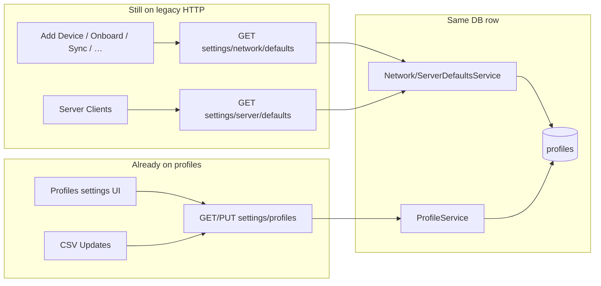

# Migration plan — Legacy network/server defaults → Profiles API

Migrate all callers from the legacy singleton endpoints to the Profiles API,
while keeping the **same 13 default field values** for the fixed Network and
Server profiles.

---

## 1. Goal & non-goals

### 1.1 Goal

1. Every frontend (and remaining HTTP) consumer that today calls
   `/api/settings/network/defaults` or `/api/settings/server/defaults`
   reads/writes the equivalent data via `/api/settings/profiles` /
   `/api/settings/profiles/{profile_id}`.
2. For the two fixed profiles (`built_in_key === "network"` /
   `"server"`), the **13 value fields** returned to callers are identical
   to what the legacy GET endpoints return today.
3. After migration, legacy HTTP endpoints can be deprecated and removed
   without breaking product flows.
4. Cache keys and permissions are consistent: one source of truth for
   defaults data.
5. **`frontend/src/components/features/settings/common` is deleted entirely.**
   No Settings “Common” menu remains; SNMP and Profiles live under
   Settings → Defaults. When migration finishes, that directory must
   contain zero files and be removed from the tree.

### 1.2 Non-goals

- Changing the shape or meaning of the 13 defaults fields
  (`location`, `platform`, `interface_status`, `interface_type`,
  `device_status`, `device_type`, `ip_address_status`, `ip_prefix_status`,
  `namespace`, `device_role`, `secret_group`, `csv_delimiter`,
  `csv_quote_char`).
- Redesigning the Profiles admin UI under
  `frontend/src/components/features/settings/defaults/profiles/`
  (already on the new API).
- Forcing every consumer to grow a full profile picker (only features
  that benefit from custom profiles need that; most keep an implicit
  Network or Server built-in).
- Dropping the `network_defaults` / `server_defaults` DB tables in the
  same PR as frontend migration (optional final cleanup phase).

---

## 2. Current state (verified)

### 2.1 Backend — already profile-backed

| Surface | Role today |
|---------|------------|
| Table `profiles` | **Source of truth** for all defaults values |
| `ProfileService` + `/api/settings/profiles` | Full CRUD; permission `settings.defaults` |
| `NetworkDefaultsService` / `ServerDefaultsService` | Thin facades over `built_in_key` `"network"` / `"server"` |
| `/api/settings/network/defaults` | Compatibility HTTP; permission `settings.nautobot` |
| `/api/settings/server/defaults` | Compatibility HTTP; permission `settings.server` |
| Tables `network_defaults` / `server_defaults` | Read **once** at startup seed only; **no dual-write** after seed |

Startup (`main.py`) calls `ProfileService.ensure_builtin_profiles_seeded()`:
if no row exists for `built_in_key` `network`/`server`, copy from the
legacy singleton tables (or dataclass defaults) into `profiles`.

**Stable identity for built-ins is `built_in_key`, not `id`.** Profile IDs
are normal autoincrement PKs and may differ per environment.

### 2.2 Field mapping (legacy GET/POST `data` ↔ profile)

| Legacy `data` field | Profile field | Notes |
|---------------------|---------------|--------|
| all 13 value fields | same names | 1:1 |
| — | `id` | profiles only |
| — | `name` | `"Network"` / `"Server"` for built-ins (rename locked) |
| — | `built_in_key` | `"network"` / `"server"` / `null` |
| — | `is_built_in` | derived: `built_in_key is not None` |

Consumers that only need the 13 fields should strip identity fields when
passing values into forms/payloads (same as CSV Updates does today).

### 2.3 Frontend — split migration status

| Area | Status |
|------|--------|
| Settings → Defaults → Profiles UI | **Done** — uses `settings/profiles` |
| CSV Updates tool | **Done** — list + `built_in_key === 'network'` default |
| Add Device, Onboard, Sync Devices, Bulk Edit CSV, Nautobot Export, CheckMK sync dialog, Jobs CSV Import | **Legacy** — `settings/network/defaults` |
| Server Clients add/update to Nautobot | **Legacy** — `settings/server/defaults` via `useServerDefaultsQuery` |
| Shared hooks `useNetworkDefaultsQuery` / `useServerDefaultsQuery` | Still hit legacy URLs; live under `settings/common/` |
| Mutation hooks for network/server defaults | Orphaned (admin tabs removed); safe to delete |
| SNMP mapping admin UI | **Done** — moved to `settings/defaults/snmp/` (route + sidebar) |
| Settings → Common menu / page | **Removed** — directory leftover is not a nav target |



Because both paths already read `profiles`, values usually match today.
Migration is still required to:

- unify permissions (`settings.defaults` vs `settings.nautobot` /
  `settings.server`);
- unify TanStack Query cache keys (admin saves invalidate `profiles.*`,
  legacy consumers cache `commonSettings.networkDefaults` /
  `serverDefaults` — **stale UI risk**);
- remove the compatibility layer cleanly;
- **eliminate `settings/common/`** (see §2.5).

### 2.5 Frontend — `settings/common/` leftovers (must go)

The old Common settings page and SNMP dialogs/tabs under `common/` are
already gone. SNMP lives at
`frontend/src/components/features/settings/defaults/snmp/`.

What remains in `frontend/src/components/features/settings/common/` is
**shared leftover library code**, not a Settings app:

| Path under `common/` | Role today | End state |
|----------------------|------------|-----------|
| `types/defaults-fields.ts` | Still imported by Profiles + server-clients | Move next to Profiles (e.g. `defaults/profiles/types/` or `defaults/shared/`) |
| `utils/defaults-fields-constants.ts` | Still imported by Profiles | Same relocation |
| `hooks/use-server-defaults-query.ts` | Still used by server-clients | Replace with profile built-in hook under `defaults/profiles/hooks/`, then delete |
| `hooks/use-network-defaults-query.ts` | Orphan (callers hit API inline) | Delete once consumers use Profiles hooks |
| `hooks/use-*-defaults-mutations.ts` | Orphan | Delete |
| `types/network-defaults.ts` | Unused alias | Delete |
| `utils/network-defaults-constants.ts` | Unused alias | Delete |

**Hard exit criterion:** after migration,
`frontend/src/components/features/settings/common` does not exist.
Any still-needed types/constants/hooks live under
`frontend/src/components/features/settings/defaults/profiles/`.

**Execute cleanup via the ordered checklist in Phase F (F.0–F.6).**
F.0 (orphan delete) may run before consumer migration; F.5 (directory
removal) only after A–C and F.1–F.4.

### 2.4 Reference pattern (already migrated)

CSV Updates resolves the Network built-in without hard-coding an ID:

```ts
// use-csv-wizard.ts
const network = profiles.find(p => p.built_in_key === 'network')
```

Reuse this pattern for all “implicit Network defaults” consumers.

---

## 3. Target architecture

### 3.1 Shared frontend resolution helpers

Add (or extend) hooks under
`frontend/src/components/features/settings/defaults/profiles/hooks/`
so consumers do not re-implement list-and-find logic:

| Helper | Behavior |
|--------|----------|
| `useProfilesQuery` | Existing — `GET settings/profiles` |
| `useProfileQuery(id)` | Existing — `GET settings/profiles/{id}` |
| `useBuiltInProfileQuery('network' \| 'server')` | **New** — list (or dedicated lookup), find by `built_in_key`, return `Profile \| DefaultsFields` |
| Optional: keep thin aliases `useNetworkDefaultsQuery` / `useServerDefaultsQuery` | Re-implement **on top of** `useBuiltInProfileQuery`, strip identity fields, keep old return type `DefaultsFields` for minimal call-site churn |

**Preferred migration path for most callers:** keep the familiar
`useNetworkDefaultsQuery` / `useServerDefaultsQuery` names and return
type (`DefaultsFields`), but change the implementation to profiles.
That preserves “same result” for forms while switching the HTTP path.

### 3.2 API usage rules

| Need | Call |
|------|------|
| Load Network defaults (13 fields) | Resolve `built_in_key === 'network'`, then use fields (from list item **or** `GET settings/profiles/{id}`) |
| Load Server defaults | Same with `"server"` |
| Save from Profiles admin | Existing `PUT settings/profiles/{id}` |
| Optional profile picker (custom profiles) | List + select by `id` (CSV Updates pattern) |
| Do **not** hard-code numeric `profile_id` | IDs differ per DB |

**Optional backend enhancement (not required for migration):**

`GET /api/settings/profiles/by-key/{built_in_key}` — avoids list-then-filter
and documents the built-in contract. If added, put it **before**
`/{profile_id}` in the router (or use a non-colliding path). Frontend
can ship without this by listing profiles (small N).

### 3.3 Response equivalence checklist

For Network (and likewise Server), after migration a consumer must still
receive the same values for:

```
location, platform, interface_status, interface_type,
device_status, device_type, ip_address_status, ip_prefix_status,
namespace, device_role, secret_group, csv_delimiter, csv_quote_char
```

Extra profile fields (`id`, `name`, `built_in_key`, `is_built_in`) must
not break forms that expect only `DefaultsFields` — strip or map in the
shared hook.

### 3.4 Permissions

| Endpoint | Permission today |
|----------|------------------|
| Profiles | `settings.defaults` read/write |
| Legacy network defaults | `settings.nautobot` read/write |
| Legacy server defaults | `settings.server` read/write |

**Migration implication:** roles that only have `settings.nautobot:read`
(or `settings.server:read`) but lack `settings.defaults:read` will lose
access when callers switch, unless RBAC is updated.

**Plan:**

1. Audit role grants (operator seed, custom roles).
2. Ensure every role that currently can read network/server defaults also
   has `settings.defaults:read` (and write where they could POST legacy).
3. Document the permission consolidation in release notes.
4. Prefer granting `settings.defaults` rather than weakening the profiles
   router to accept the old resources.

---

## 4. Work breakdown

Execute in order. **F.0 (orphan delete) may run first** without waiting
for A–C. Directory removal (F.5) requires A–C + F.1–F.4.

| Phase | Purpose | Touches `common/`? |
|-------|---------|-------------------|
| **F.0** | Delete unused orphan files | Yes — shrinks it |
| **A** | Profiles-based built-in hooks under `defaults/profiles/hooks/` | Prefer moving types early (F.1) or keep temp imports |
| **B** | Migrate all network consumers off legacy HTTP | No (uses new hooks) |
| **C** | Migrate server consumers off legacy HTTP | Yes — drops last hook user |
| **D** | Optional type convergence (`NautobotDefaults` → `DefaultsFields`) | No |
| **E** | Backend deprecate/remove legacy routers | No |
| **F.1–F.6** | Move remaining shared code; delete `common/` | Yes — **directory gone** |

### Phase A — Shared frontend adapter (foundation)

1. Implement `useBuiltInProfileQuery(builtInKey)` (or rewire existing
   network/server query hooks to call profiles) **under**
   `settings/defaults/profiles/hooks/` — do **not** add new code under
   `settings/common/`.
2. Map `Profile` → `DefaultsFields` (omit identity fields). If
   `DefaultsFields` still lives in `common/`, either keep a temporary
   import or move the type into `defaults/` in the same PR (preferred).
3. Query keys:
   - Prefer invalidating under `queryKeys.profiles.*`.
   - While dual keys exist, **also** invalidate
     `commonSettings.networkDefaults` / `serverDefaults` from
     `useProfileMutations` (and vice versa during transition) so admin
     saves refresh consumers immediately.
4. Add a small unit/test or MSW mock update proving Network fields come
   from `settings/profiles` and match the legacy shape.
5. Delete unused `useNetworkDefaultsMutations` /
   `useServerDefaultsMutations` once confirmed unused (or rewrite them to
   `PUT` the built-in profile if anything still needs write via those
   names).

**Exit criteria:** one hook implementation under `defaults/profiles/`;
no remaining `apiCall('settings/network/defaults')` inside shared
settings hooks. Progress toward emptying `settings/common/` (orphans
deleted when unused).

### Phase B — Migrate network consumers (one PR or sequenced PRs)

Replace every `settings/network/defaults` call with the shared adapter
(or inline list+find only if temporary). Inventory:

| File | Usage |
|------|--------|
| `nautobot/add-device/hooks/queries/use-nautobot-dropdowns-query.ts` | Form prefill |
| `nautobot/add-device/add-device-page.test.tsx` | Mock URL |
| `nautobot/onboard/hooks/use-onboarding-data.ts` | Form defaults |
| `nautobot/onboard/hooks/use-csv-upload.ts` | CSV delimiter/quote |
| `nautobot/sync-devices/hooks/use-sync-devices-queries.ts` | Namespace / statuses |
| `nautobot/tools/bulk-edit/dialogs/csv-upload-dialog.tsx` | CSV chars |
| `checkmk/hosts-inventory/dialogs/device-sync-dialog.tsx` | “Use default values” |
| `jobs/templates/hooks/use-template-queries.ts` | CSV Import chars |
| `app/(dashboard)/nautobot-export/page.tsx` | CSV chars |

**Exit criteria:** `rg "settings/network/defaults" frontend/` returns no
matches (except docs/comments if any).

### Phase C — Migrate server consumers

| File | Usage |
|------|--------|
| `server-clients/server/hooks/use-add-server-to-nautobot.ts` | Validate + payload |
| `server-clients/server/hooks/use-update-server-to-nautobot.ts` | Same |

Keep `build-nautobot-payload.ts` / `map-server-interfaces.ts` on
`DefaultsFields`; only the data source changes.

**Exit criteria:** `rg "settings/server/defaults" frontend/` is empty.

### Phase D — Type cleanup (optional but recommended)

Converge duplicated `NautobotDefaults` partial types onto shared
`DefaultsFields` / `Profile` from settings:

- `add-device/types`, `sync-devices/types`, `jobs/templates/types`,
  `connections/nautobot/types`, `shared/device-form`

Do this after call sites compile against the shared hook return type.

### Phase E — Backend deprecation & removal

Order:

1. **Deprecate** legacy routers: log warning on use, OpenAPI description
   “deprecated”, changelog entry. Keep facades working.
2. Confirm no frontend / external scripts / integration tests still hit
   the legacy URLs (update
   `tests/integration/repositories/test_rbac_enforcement_pg.py` probes
   to profiles).
3. **Remove** `network_defaults` / `server_defaults` routers from
   `main.py` and package exports.
4. Decide fate of `NetworkDefaultsService` / `ServerDefaultsService`:
   - Keep as internal helpers for Celery/tasks
     (`settings_manager.get_network_defaults()`), **or**
   - Point tasks at `ProfileService.get_by_built_in_key(...)` and delete
     the facade services.
5. Optional schema cleanup: stop seeding from legacy tables; drop
   `network_defaults` / `server_defaults` models once nothing reads them
   (seed already copies into `profiles` — verify then drop).

**Backend callers that already bypass HTTP** (fine to leave until Phase E):

- `SettingsManager.get_network_defaults()` / `get_server_defaults()`
- Celery tasks such as `tasks/check_ip_task.py`

These already use the profile-backed services; they do not need the HTTP
migration, only eventual facade cleanup.

### Phase F — Remove `settings/common/` (detailed checklist)

**Prerequisite:** Phases A–C complete (no remaining
`settings/network/defaults` or `settings/server/defaults` callers;
built-in Network/Server reads go through Profiles hooks).

**Target end-state layout** (decision locked for this plan):

```
frontend/src/components/features/settings/defaults/
├── profiles/
│   ├── types/
│   │   ├── index.ts                 # Profile + re-export DefaultsFields
│   │   └── defaults-fields.ts       # moved from common/types/
│   ├── utils/
│   │   ├── constants.ts             # existing EMPTY_PROFILES, …
│   │   └── defaults-fields-constants.ts  # moved from common/utils/
│   ├── hooks/
│   │   ├── use-profiles-query.ts
│   │   ├── use-profile-query.ts
│   │   ├── use-profile-mutations.ts
│   │   ├── use-built-in-profile-query.ts   # NEW (Phase A)
│   │   ├── use-network-defaults-query.ts   # NEW thin alias → built-in "network"
│   │   └── use-server-defaults-query.ts    # NEW thin alias → built-in "server"
│   └── …
└── snmp/                            # already migrated; untouched by F
```

Do **not** create `defaults/shared/` unless a later need appears; SNMP does
not use `DefaultsFields`.

**Keep** `queryKeys.commonSettings.snmpMapping()` for now (SNMP still uses
it). Only remove `networkDefaults` / `serverDefaults` keys. Optional
follow-up: rename SNMP key to `queryKeys.defaults.snmpMapping` — not
required to delete `settings/common/`.

---

#### F.0 — Delete orphans immediately (can run any time; even before A)

These files have **no external importers** today. Delete them first to
shrink the directory:

| Delete | Reason |
|--------|--------|
| `common/hooks/use-network-defaults-mutations.ts` | Admin tabs gone; unused |
| `common/hooks/use-server-defaults-mutations.ts` | Admin tabs gone; unused |
| `common/hooks/use-network-defaults-query.ts` | Unused (callers hit API inline) |
| `common/types/network-defaults.ts` | Unused alias |
| `common/utils/network-defaults-constants.ts` | Unused alias |

```bash
# After F.0 — these five paths must not exist
rg "use-network-defaults-mutations|use-server-defaults-mutations|use-network-defaults-query|network-defaults-constants|types/network-defaults" frontend/src
```

Still remaining after F.0 (must migrate, then delete):

- `common/types/defaults-fields.ts`
- `common/utils/defaults-fields-constants.ts`
- `common/hooks/use-server-defaults-query.ts`

---

#### F.1 — Move shared types & constants into Profiles

1. Create
   `defaults/profiles/types/defaults-fields.ts` with the contents of
   `common/types/defaults-fields.ts` (`DefaultsFields`; keep
   `DefaultsApiResponse` only if something still needs it — after A–C
   prefer dropping it).
2. Create
   `defaults/profiles/utils/defaults-fields-constants.ts` with
   `EMPTY_DEFAULTS_FIELDS` and `DEFAULTS_FIELDS_CACHE_TIME` (or fold
   into existing `defaults/profiles/utils/constants.ts` if preferred —
   either is fine; one home only).
3. Update `defaults/profiles/types/index.ts` to import `DefaultsFields`
   from `./defaults-fields` (not from `common/`) and re-export it:

```ts
export type { DefaultsFields } from './defaults-fields'
export type { DefaultsFields as NetworkDefaults } from './defaults-fields'
export type { DefaultsFields as ServerDefaults } from './defaults-fields'
```

4. Rewrite every importer (exact list as of plan date):

| File | Old import | New import |
|------|------------|------------|
| `defaults/profiles/types/index.ts` | `common/types/defaults-fields` | `./defaults-fields` |
| `defaults/profiles/profiles-settings.tsx` | `common/types/…` + `common/utils/…` | `./types` + `./utils/defaults-fields-constants` |
| `defaults/profiles/components/defaults-settings-form.tsx` | `common/types/defaults-fields` | `../types` |
| `defaults/profiles/hooks/use-profile-mutations.ts` | `common/types/defaults-fields` | `../types` |
| `defaults/profiles/dialogs/add-profile-dialog.tsx` | `common/utils/defaults-fields-constants` | `../utils/defaults-fields-constants` |
| `server-clients/server/utils/build-nautobot-payload.ts` | `common/types/defaults-fields` | `settings/defaults/profiles/types` |
| `server-clients/server/utils/build-nautobot-payload.test.ts` | same | same |
| `server-clients/server/utils/map-server-interfaces.ts` | same | same |
| `server-clients/server/utils/map-server-interfaces.test.ts` | same | same |

5. Delete the old files only after imports compile:

- `common/types/defaults-fields.ts`
- `common/utils/defaults-fields-constants.ts`

```bash
rg "settings/common/types/defaults-fields|settings/common/utils/defaults-fields-constants" frontend/src
# must be empty
```

---

#### F.2 — Replace `useServerDefaultsQuery` (last live hook in `common/`)

1. Ensure Phase A added under `defaults/profiles/hooks/`:

   - `useBuiltInProfileQuery('network' \| 'server')` → returns
     `DefaultsFields` (strip identity fields), uses
     `queryKeys.profiles.*`.
   - Optional convenience aliases:
     `useNetworkDefaultsQuery` / `useServerDefaultsQuery` in the **same**
     `defaults/profiles/hooks/` folder (same names as before for call-site
     stability).

2. Update server-clients hooks:

| File | Change |
|------|--------|
| `server-clients/server/hooks/use-add-server-to-nautobot.ts` | Import `useServerDefaultsQuery` from `settings/defaults/profiles/hooks/use-server-defaults-query` (or call `useBuiltInProfileQuery('server')`) |
| `server-clients/server/hooks/use-update-server-to-nautobot.ts` | Same |

3. Delete `common/hooks/use-server-defaults-query.ts`.

```bash
rg "settings/common/hooks|use-server-defaults-query" frontend/src
# no hits under settings/common; only the new profiles hook path
```

---

#### F.3 — Finish network consumer cache keys (from Phases B leftovers)

Any consumer that still uses `queryKeys.commonSettings.networkDefaults()`
must switch to `queryKeys.profiles.list()` / `detail(id)` (or the key
used by `useBuiltInProfileQuery`). Known leftover key users:

| File |
|------|
| `nautobot/sync-devices/hooks/use-sync-devices-queries.ts` |
| `jobs/templates/hooks/use-template-queries.ts` |

(Other network callers may use inline `apiCall` without this key — still
migrate the API path in Phase B.)

---

#### F.4 — Query-key & mutation cleanup

1. In `frontend/src/lib/query-keys.ts`, remove:

   - `commonSettings.networkDefaults`
   - `commonSettings.serverDefaults`

   Keep `commonSettings.snmpMapping` (or relocate SNMP key in a separate
   optional PR).

2. In `use-profile-mutations.ts`, invalidate **only**
   `queryKeys.profiles.all` (drop any temporary dual-invalidation of
   network/server defaults keys added in Phase A).

3. Confirm no remaining references:

```bash
rg "networkDefaults|serverDefaults" frontend/src/lib/query-keys.ts frontend/src
```

---

#### F.5 — Delete `settings/common/` directory

1. Confirm the directory is empty of tracked source files (only empty
   dirs left is fine):

```bash
find frontend/src/components/features/settings/common -type f
# must print nothing
```

2. Remove the directory:

```bash
rm -rf frontend/src/components/features/settings/common
```

3. Final verification (all must pass):

```bash
test ! -d frontend/src/components/features/settings/common
rg "settings/common" frontend/src          # empty
rg "settings/network/defaults|settings/server/defaults" frontend/src  # empty
cd frontend && npm run lint
```

---

#### F.6 — Phase F exit criteria (checklist)

- [ ] Orphans from F.0 deleted
- [ ] `DefaultsFields` + `EMPTY_DEFAULTS_FIELDS` live under `defaults/profiles/`
- [ ] All former `common/` imports rewritten (table in F.1)
- [ ] Server-clients use Profiles built-in server hook (F.2)
- [ ] No `queryKeys.commonSettings.networkDefaults|serverDefaults`
- [ ] Directory `frontend/src/components/features/settings/common` does not exist
- [ ] `rg "settings/common" frontend/src` is empty
- [ ] Lint clean

---

## 5. Recommended implementation detail (Phase A)

### 5.1 Minimal change — rewire under `defaults/profiles/hooks/`

Create `use-built-in-profile-query.ts` (and optional thin aliases
`use-network-defaults-query.ts` / `use-server-defaults-query.ts`) **in
`defaults/profiles/hooks/`**, not under `common/`.

```ts
// defaults/profiles/hooks/use-network-defaults-query.ts (conceptual)
export function useNetworkDefaultsQuery(options = DEFAULT_OPTIONS) {
  const { data: profiles, isLoading, error, ...rest } = useProfilesQuery()
  const fields = useMemo(() => {
    const profile = profiles?.find(p => p.built_in_key === 'network')
    if (!profile) return EMPTY_DEFAULTS_FIELDS
    return pickDefaultsFields(profile) // 13 fields only
  }, [profiles])

  return { ...rest, data: fields, isLoading, error }
}
```

Same for server with `built_in_key === 'server'`.

**Pros:** tiny diffs at call sites; same return type; same UX.
**Cons:** every “network defaults” fetch also loads the full profile list
(acceptable; list is small). Alternatively resolve ID once then
`useProfileQuery(id)` if you want detail caching.

### 5.2 Cache invalidation during transition

In `use-profile-mutations.ts` `onSuccess`:

```ts
queryClient.invalidateQueries({ queryKey: queryKeys.profiles.all })
queryClient.invalidateQueries({ queryKey: queryKeys.commonSettings.networkDefaults() })
queryClient.invalidateQueries({ queryKey: queryKeys.commonSettings.serverDefaults() })
```

Remove the last two lines when Phase F deletes the legacy keys.

### 5.3 Auth failure mode

If a user can open Add Device but lacks `settings.defaults:read`, the
new hook will 403 where legacy might have succeeded with
`settings.nautobot:read`. Fix grants **before** or **with** Phase B.

---

## 6. Testing plan

### Frontend

- Update mocks that assert URL `settings/network/defaults` →
  `settings/profiles` (and optionally assert `built_in_key`).
- Manual smoke:
  1. Set a distinctive value in Profiles UI (Network / Server).
  2. Open Add Device / Onboard / Sync / Server→Nautobot / CSV tools.
  3. Confirm the distinctive value appears (form defaults, CSV chars, etc.).
  4. Confirm saving in Profiles immediately refreshes those screens
     (focus/refetch or navigation).

### Backend

- Keep existing unit tests for `NetworkDefaultsService` /
  `ServerDefaultsService` until facades are removed.
- Add/extend profile service tests for built-in seed and
  `get_by_built_in_key`.
- Switch RBAC integration probes to `/api/settings/profiles`.
- Before dropping legacy tables: assert seed path and that no repository
  still queries `NetworkDefault` / `ServerDefault` except seed (then
  remove seed readers).

### Regression guard

```bash
# Frontend — must be empty after Phases B–C
rg "settings/network/defaults|settings/server/defaults" frontend/src

# Frontend — must be empty after Phase F
test ! -d frontend/src/components/features/settings/common
rg "settings/common" frontend/src

# Backend — after Phase E removal
rg "network_defaults_router|server_defaults_router" backend/
```

---

## 7. Risk register

| Risk | Mitigation |
|------|------------|
| Permission mismatch (`settings.nautobot` vs `settings.defaults`) | RBAC audit + grant `settings.defaults` to affected roles before switching callers |
| Stale TanStack cache after Profiles save | Dual invalidation until legacy keys removed |
| Hard-coded profile IDs in future code | Document: always resolve via `built_in_key` |
| List endpoint heavier than singleton GET | Negligible; optional `by-key` endpoint later |
| Legacy tables diverge from `profiles` | Already true after seed; do not reintroduce dual-write; drop tables in Phase E |
| Partial PUT vs legacy POST semantics | Consumers that only **read** are unaffected; any write path must use profile `PUT` with `exclude_unset` semantics |

---

## 8. Suggested PR sequence

1. **PR0 — Orphans (F.0):** Delete unused mutation hooks, unused
   `use-network-defaults-query`, and `network-defaults*` aliases under
   `common/`. No behavior change.
2. **PR1 — Adapter (Phase A):** Add `useBuiltInProfileQuery` (+ optional
   network/server aliases) under `defaults/profiles/hooks/`; dual cache
   invalidation during transition; RBAC grant notes. Prefer also doing
   **F.1** (move `DefaultsFields` into `defaults/profiles/`) in this PR
   so new code never imports from `common/`.
3. **PR2 — Network consumers (Phase B):** Replace inline
   `apiCall('settings/network/defaults')` with shared hooks; fix
   tests/mocks; switch leftover `queryKeys.commonSettings.networkDefaults`
   users to `queryKeys.profiles.*`.
4. **PR3 — Server consumers (Phase C + F.2):** Point server-clients at
   Profiles server built-in hook; delete
   `common/hooks/use-server-defaults-query.ts`.
5. **PR4 — Remove `settings/common/` (F.3–F.6):** Drop legacy query keys;
   remove dual invalidation; ensure directory is empty; `rm -rf`
   `settings/common`; run verification commands in F.5.
6. **PR5 — Backend deprecate/remove (Phase E):** Legacy routers, then
   optional table drop / facade collapse.

PR0 can land anytime. PR4 is incomplete until `settings/common` is gone.

---

## 9. Definition of done

- [ ] No frontend references to `settings/network/defaults` or
      `settings/server/defaults`.
- [ ] Built-in Network/Server values used by product flows come from
      `settings/profiles` (via `built_in_key`).
- [ ] Profiles admin save invalidates the same cache consumers read.
- [ ] Roles that previously could read defaults still can
      (`settings.defaults:read` granted where needed).
- [ ] Legacy HTTP endpoints deprecated or removed with tests updated.
- [ ] **`frontend/src/components/features/settings/common` is removed**
      (directory deleted; no imports of `@/components/features/settings/common/...`).
- [ ] Shared defaults types/constants live under
      `frontend/src/components/features/settings/defaults/`.
- [ ] `npm run lint` (frontend) and backend tests for touched areas pass.
- [ ] Manual smoke confirms Network and Server distinctive values propagate.

---

## 10. Key file index

### Backend

- `backend/routers/settings/profiles.py`
- `backend/routers/settings/network_defaults.py` *(legacy)*
- `backend/routers/settings/server_defaults.py` *(legacy)*
- `backend/services/settings/profile_service.py`
- `backend/services/settings/network_defaults_service.py`
- `backend/services/settings/server_defaults_service.py`
- `backend/repositories/settings/profile_repository.py`
- `backend/core/models/settings.py` — `Profile`, `NetworkDefault`, `ServerDefault`
- `backend/models/settings.py` — Pydantic request/response schemas

### Frontend — Defaults apps (done)

- `frontend/src/components/features/settings/defaults/profiles/**`
- `frontend/src/components/features/settings/defaults/snmp/**`

### Frontend — `settings/common/` (legacy leftovers — delete by Phase F)

Must be empty/removed at end of migration. See **Phase F checklist
(F.0–F.6)** for exact move/delete/import steps.

Until then (after F.0 orphans are gone, only these should remain briefly):

- `…/common/types/defaults-fields.ts` → move to `defaults/profiles/types/`
- `…/common/utils/defaults-fields-constants.ts` → move to `defaults/profiles/utils/`
- `…/common/hooks/use-server-defaults-query.ts` → replace then delete

- `frontend/src/lib/query-keys.ts` — drop `networkDefaults` /
  `serverDefaults`; keep SNMP key until a separate rename

### Frontend — Consumers to migrate

See Phase B and Phase C tables above. Reference implementation:
`frontend/src/components/features/nautobot/tools/csv-updates/hooks/use-csv-wizard.ts`.
